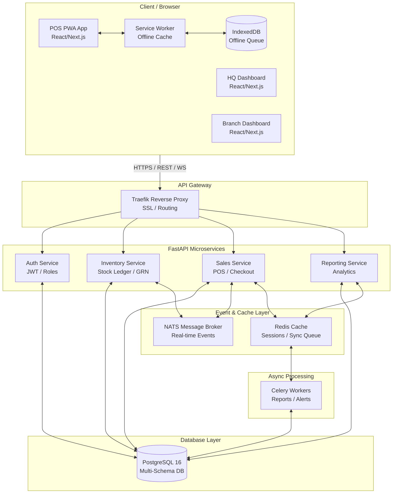

# Grocery ERP - System Architecture Visualization

This document outlines the high-level architecture for the Multi-Branch Grocery ERP, incorporating our existing infrastructure (Traefik, NATS, PostgreSQL) with the new requirements (Redis, Celery, Offline PWA).

## System Design Diagram

## Architectural Highlights

* Offline-First POS Safety Net: The POS app relies on standard HTTPS requests. If the connection drops, a Service Worker intercepts the request, saves the cart to IndexedDB, and queues it.

* The Stock Ledger Source of Truth: Instead of simply updating a number in a table, every single stock movement (sale, transfer, damage) is recorded as a line item in the stock_ledger table. This guarantees perfect auditability.

* Event-Driven Real-Time Updates: When a sale occurs, the Sales Service publishes to NATS. The HQ Dashboard subscribes to these events via WebSockets for sub-second live updates.

* Background Heavy Lifting: Generating monthly profit reports across 5 branches takes time. Celery workers will handle these async tasks so the API never blocks.
